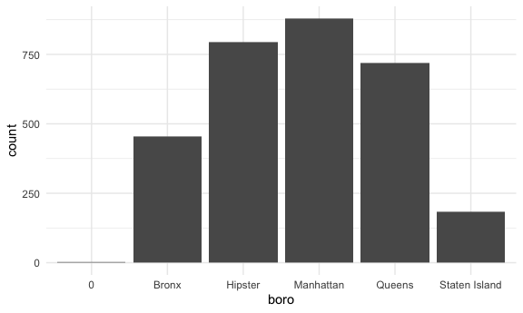

data wrangling 2
================
Pallavi Krishnamurthy

## Restaurant inspections

``` r
api_url = "https://data.cityofnewyork.us/resource/43nn-pn8j.csv"

rest_inspections = 
  GET(api_url, query = list("$limit" = 50000)) %>% 
  content("parsed")
```

    ## Parsed with column specification:
    ## cols(
    ##   .default = col_character(),
    ##   camis = col_double(),
    ##   zipcode = col_double(),
    ##   inspection_date = col_datetime(format = ""),
    ##   score = col_double(),
    ##   grade_date = col_datetime(format = ""),
    ##   record_date = col_datetime(format = ""),
    ##   latitude = col_double(),
    ##   longitude = col_double(),
    ##   community_board = col_double(),
    ##   bin = col_double(),
    ##   bbl = col_double()
    ## )

    ## See spec(...) for full column specifications.

    ## Warning: 14 parsing failures.
    ##   row     col expected actual         file
    ##  7487 zipcode a double    N/A <raw vector>
    ##  8888 zipcode a double    N/A <raw vector>
    ## 11254 zipcode a double    N/A <raw vector>
    ## 12152 zipcode a double    N/A <raw vector>
    ## 15139 zipcode a double    N/A <raw vector>
    ## ..... ....... ........ ...... ............
    ## See problems(...) for more details.

``` r
rest_inspections %>% 
  count(boro, grade) %>% 
  pivot_wider(names_from = grade, values_from = n)
```

    ## # A tibble: 6 x 9
    ##   boro              A     B  `NA`     C     N     P     Z     G
    ##   <chr>         <int> <int> <int> <int> <int> <int> <int> <int>
    ## 1 0                11     1    20    NA    NA    NA    NA    NA
    ## 2 Bronx          1755   333  2246   132    15    31    15    NA
    ## 3 Brooklyn       5032   833  6419   299    65   118    38    NA
    ## 4 Manhattan      7859  1196  9711   509   129   118    48     1
    ## 5 Queens         4644   750  5532   314    61    74    39    NA
    ## 6 Staten Island   695   108   789    37    13     7     3    NA

``` r
rest_inspections %>% 
  filter(grade %in% c("A", "B", "C"), boro != "0")
```

    ## # A tibble: 24,496 x 26
    ##     camis dba   boro  building street zipcode phone cuisine_descrip…
    ##     <dbl> <chr> <chr> <chr>    <chr>    <dbl> <chr> <chr>           
    ##  1 5.00e7 NEW … Quee… 5615     JUNCT…   11373 7186… Chinese         
    ##  2 5.00e7 BIRD… Broo… 1215     MYRTL…   11221 9176… American        
    ##  3 5.01e7 DUNK… Manh… 353      AMSTE…   10024 3477… Donuts          
    ##  4 4.08e7 CIND… Broo… 1806     MCDON…   11223 7186… Latin (Cuban, D…
    ##  5 4.16e7 OLGA… Manh… 3409     BROAD…   10031 2122… Pizza           
    ##  6 5.01e7 HAO … Bronx 1791     MONRO…   10457 7189… Chinese         
    ##  7 5.01e7 NUCH… Manh… 00       BROAD…      NA 2129… Spanish         
    ##  8 4.16e7 WAT'… Manh… 513      WEST …   10031 2122… Caribbean       
    ##  9 4.16e7 SUBW… Broo… 1620     KINGS…   11229 7189… Sandwiches      
    ## 10 4.09e7 GRAN… Manh… 0        @ GRA…      NA 6462… American        
    ## # … with 24,486 more rows, and 18 more variables: inspection_date <dttm>,
    ## #   action <chr>, violation_code <chr>, violation_description <chr>,
    ## #   critical_flag <chr>, score <dbl>, grade <chr>, grade_date <dttm>,
    ## #   record_date <dttm>, inspection_type <chr>, latitude <dbl>, longitude <dbl>,
    ## #   community_board <dbl>, council_district <chr>, census_tract <chr>,
    ## #   bin <dbl>, bbl <dbl>, nta <chr>

Let’s look at pizza places.

``` r
rest_inspections %>%
  mutate(dba = str_to_upper(dba)) %>% 
  filter(str_detect(dba, "PIZZA"))
```

    ## # A tibble: 2,327 x 26
    ##     camis dba   boro  building street zipcode phone cuisine_descrip…
    ##     <dbl> <chr> <chr> <chr>    <chr>    <dbl> <chr> <chr>           
    ##  1 4.16e7 2 BR… Broo… 395      FLATB…   11201 7187… Pizza           
    ##  2 4.16e7 OLGA… Manh… 3409     BROAD…   10031 2122… Pizza           
    ##  3 4.04e7 ELMH… Quee… 83-07    BROAD…   11373 7182… Pizza           
    ##  4 5.01e7 & PI… Manh… 15       WEST …   10001 2127… Pizza           
    ##  5 5.01e7 2 BR… Bronx 207      EAST …   10458 9177… Pizza           
    ##  6 5.01e7 LATI… Quee… 150-19   LIBER…   11433 7188… Latin (Cuban, D…
    ##  7 5.01e7 NOEL… Bronx 38       WEST …   10468 7182… Pizza           
    ##  8 5.01e7 CHAM… Manh… 2        WEST …   10011 2128… Pizza           
    ##  9 5.00e7 99 C… Manh… 105      STANT…   10002 2123… Pizza           
    ## 10 4.07e7 PIZZ… Broo… 8521     18 AV…   11214 7188… Pizza           
    ## # … with 2,317 more rows, and 18 more variables: inspection_date <dttm>,
    ## #   action <chr>, violation_code <chr>, violation_description <chr>,
    ## #   critical_flag <chr>, score <dbl>, grade <chr>, grade_date <dttm>,
    ## #   record_date <dttm>, inspection_type <chr>, latitude <dbl>, longitude <dbl>,
    ## #   community_board <dbl>, council_district <chr>, census_tract <chr>,
    ## #   bin <dbl>, bbl <dbl>, nta <chr>

``` r
rest_inspections %>%
  mutate(dba = str_to_upper(dba)) %>% 
  filter(str_detect(dba, "PIZZA")) %>% 
  count(boro, grade) %>% 
  pivot_wider(names_from = grade, values_from = n)
```

    ## # A tibble: 6 x 8
    ##   boro              A  `NA`     B     C     P     Z     N
    ##   <chr>         <int> <int> <int> <int> <int> <int> <int>
    ## 1 0                 1     1    NA    NA    NA    NA    NA
    ## 2 Bronx           148   206    33    12     2     1    NA
    ## 3 Brooklyn        250   307    27    17     6     1     5
    ## 4 Manhattan       281   363    41    16     4     4     3
    ## 5 Queens          202   241    35     5     3     1     4
    ## 6 Staten Island    41    54     9     2    NA    NA     1

``` r
rest_inspections %>% 
  mutate(dba = str_to_upper(dba)) %>% 
  filter(str_detect(dba, "PIZZ")) %>% 
  mutate(
    boro = fct_infreq(boro),
    boro = str_replace(boro, "Brooklyn", "Hipster")) %>% 
  ggplot(aes(x = boro)) +
  geom_bar()
```



## Napoleon Dynamite

Get some reviews from Amazon

``` r
nap_dyn_url = "https://www.amazon.com/product-reviews/B00005JNBQ/ref=cm_cr_arp_d_viewopt_rvwer?ie=UTF8&reviewerType=avp_only_reviews&sortBy=recent&pageNumber=1"

napoleon_html = read_html(nap_dyn_url)

review_titles =
  napoleon_html %>% 
  html_nodes(".a-text-bold span") %>% 
  html_text()

review_text =
  napoleon_html %>% 
  html_nodes(".review-text-content span") %>% 
  html_text()

nap_df = 
  tibble(
  titles = review_titles,
  text = review_text
)
```
